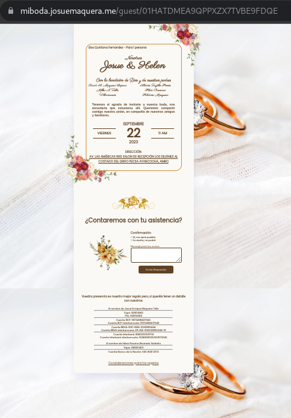

# Wedding Guest Management System


Welcome to the Wedding Guest Management System! This application allows you to generate individual links for wedding guests to confirm their attendance and leave messages for the host. It is built using Golang, follows the hexagonal architecture pattern, and utilizes MySQL with GORM for data storage.

## Table of Contents

- [Getting Started](#getting-started)
  - [Prerequisites](#prerequisites)
  - [Installation](#installation)
- [Folder Structure](#folder-structure)
- [Usage](#usage)
  - [Running the Application](#running-the-application)
- [API Endpoints](#api-endpoints)
- [Docker Deployment](#docker-deployment)
- [Contributing](#contributing)
  - [Special Thanks](#special-thanks)
- [License](#license)


## Getting Started

### Prerequisites

Before you begin, ensure you have the following prerequisites installed:

- Golang: [Download and install Go](https://golang.org/doc/install)
- MySQL: [Download and install MySQL](https://dev.mysql.com/downloads/installer/)
- GORM: GORM will be installed as a dependency later.

### Installation

1. Clone the repository:

   ```shell
   git clone https://github.com/sembh1998/wedding_invintation_generation.git
   ```

2. Access the project folder:

   ```shell
   cd wedding_invintation_generation
   ```

3. Install dependencies:

   ```shell
   go mod tidy
   ```

<details>
<summary>Folder Structure</summary>
<pre>
<code>
├── cmd/
│   ├── bootstrap/
│   │   ├── assets/
│   │   ├── embeds.go
│   │   ├── htmx/
│   │   └── jokes.go
│   └── httpserver/
│       └── main.go
├── Dockerfile
├── go.mod
├── go.sum
├── internal/
│   ├── core/
│   │   ├── domain/
│   │   ├── ports/
│   │   └── services/
│   ├── handlers/
│   │   ├── frontend/
│   │   ├── guesthdl/
│   │   ├── tokenrequired/
│   │   └── userhdl/
│   └── repositories/
│       ├── guestsrepo/
│       └── usersrepo/
├── mdcontent/
│   └── screenshot.png
└── README.md
</code>
</pre>
</details>

## Usage
### Running the Application
To run the application, use the following command:

   ```shell
   go run cmd/httpserver/main.go
   ```
## API Endpoints


- `GET /`: Home route, displaying login or main page based on authentication status.
- `POST /login`: User login endpoint.
- `GET /crudguests`: Display the CRUD interface for managing guests (requires authentication).
- `POST /add-guest`: Create a new guest (requires authentication).
- `DELETE /delete-guest/{id}`: Delete a guest by ID (requires authentication).
- `GET /guest/{id}`: Retrieve details of a specific guest by ID.
- `POST /guest/{id}/attend`: Confirm attendance for a guest.
- `GET /gift-preferences`: Display gift preferences page.
- `GET /assets`: Serve static assets (e.g., images, CSS, JS).

API v1 Endpoints

- `POST /api/v1/login`: API endpoint for user login.
- `POST /api/v1/guest`: Create a new guest via API (requires authentication).
- `GET /api/v1/guest`: Retrieve a list of all guests via API (requires authentication).
- `PUT /api/v1/guest/{id}`: Update a guest's information via API (requires authentication).
- `DELETE /api/v1/guest/{id}`: Delete a guest by ID via API (requires authentication).
- `GET /api/v1/guest/{id}`: Retrieve details of a specific guest by ID via API.
- `PUT /api/v1/guest/{id}/attend`: Confirm attendance for a guest via API.

Note: Some routes require authentication, and you should login to use it

## Docker Deployment

A Dockerfile is provided in the repository to simplify deployment. You can build a Docker image and run the application within a container. Follow these steps:

1. Build the Docker image:

   ```shell
   docker build -t wedding-guest-app .
   ```
2. Run the Docker container::

   ```shell
   docker run -p 8080:8080 wedding-guest-app
   ```
   The application will be accessible at http://localhost:8080

## Contributing

Contributions to this project are welcome! If you'd like to contribute, please follow these guidelines:

1. Fork the repository.

2. Create a new branch for your feature or bug fix:

   ```shell
   git checkout -b feature/your-feature-name
   ```

## Special Thanks

A big shoutout and heartfelt thanks to my friend [JosueDiazC](https://github.com/JosueDiazC) for their invaluable contribution to the project. Their dedication and expertise in UI design greatly enhanced the aesthetics and usability of the pages. Their commitment to this project has made it even more remarkable. Thank you, JosueDiazC, for your outstanding work!

## License

This project is licensed under the **MIT License**. The MIT License is a permissive open-source license that allows you to use, modify, and distribute this software freely. You are granted the following permissions:

- **Permission to use:** You are free to use this software for any purpose, whether it's personal, educational, or commercial.

- **Permission to modify:** You can modify and adapt the software to meet your specific needs.

- **Permission to distribute:** You can distribute the software, either in its original form or modified, to others.

- **No warranty:** The software is provided "as is," without any warranty. The author or contributors are not liable for any issues or damages that may arise from its use.

By using this software, you agree to include the original copyright notice and disclaimers in your own projects when using or distributing this code.

For more details, please see the [MIT License](LICENSE) file.

